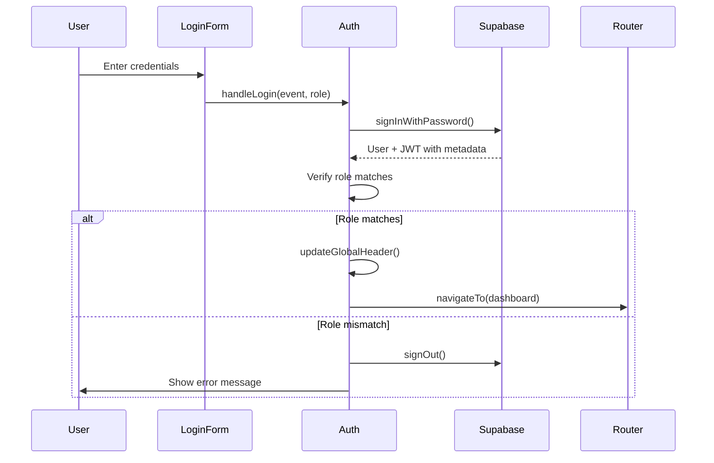

## Overview

The Authentication API provides functions for managing user authentication, session restoration, and profile management in RuedaPro UNIPAZ. All authentication is handled through Supabase Auth.

## Global Variables

<ResponseField name="currentUser" type="object | null">
  Stores the currently authenticated Supabase user object. Contains user ID, email, and metadata.
</ResponseField>

<ResponseField name="currentProfile" type="object | null">
  Stores the current user's profile information.
  
  **Properties:**
  - `id` (string): User's UUID
  - `nombre` (string): Full name
  - `rol` (string): User role - 'admin', 'docente', or 'estudiante'
  - `avatar_url` (string, optional): Profile avatar URL
</ResponseField>

## Functions

### restoreSession()

Restores an existing Supabase authentication session on page load or app initialization.

**Signature:**
```javascript
async function restoreSession()
```

<ParamField path="Returns" type="Promise<void>">
  Async function with no return value
</ParamField>

**Description:**

Checks for an active Supabase session and restores user state if found. Fetches the user's profile data including name, role, and avatar URL from the `perfiles` table. Updates global variables `currentUser` and `currentProfile`, then refreshes the header UI.

**Behavior:**
- Returns early if `supabaseClient` is not initialized
- Retrieves session using `supabaseClient.auth.getSession()`
- Extracts user metadata (nombre, rol) from JWT
- Attempts to fetch avatar from `perfiles` table
- Calls `updateGlobalHeader()` to update UI
- Logs errors to console without throwing

**Usage Example:**
```javascript
// Called on app initialization
window.addEventListener('DOMContentLoaded', async () => {
  await restoreSession();
  initRouter();
  initThemeToggle();
});
```

**Related Functions:**
- [updateGlobalHeader()](#updateglobalheader) - Updates header UI
- [handleLogin()](#handleloginevent-role) - User login

---

### handleLogin(event, role)

Handles user login form submission with role-based authentication and routing.

**Signature:**
```javascript
async function handleLogin(event, role)
```

<ParamField path="event" type="Event" required>
  Form submit event object
</ParamField>

<ParamField path="role" type="string" required>
  Expected user role: 'docente', 'estudiante', or 'admin'
</ParamField>

<ParamField path="Returns" type="Promise<void>">
  Async function with no return value
</ParamField>

**Description:**

Authenticates user credentials via Supabase and validates their role matches the login portal. Routes users to their respective dashboards on success.

**Behavior:**
1. Prevents default form submission
2. Validates `supabaseClient` is initialized
3. Extracts email and password from form inputs
4. Disables submit button and shows loading state
5. Calls `supabaseClient.auth.signInWithPassword()`
6. Verifies user's actual role matches expected role
7. Fetches avatar URL for docente role
8. Routes to appropriate dashboard:
   - `dashboard-docente` for docentes
   - `dashboard-estudiante` for estudiantes  
   - `dashboard-admin` for admins
9. Shows error if authentication fails or role mismatch
10. Signs out user if role doesn't match

**Error Handling:**
- Displays user-friendly error messages in `#login-error` div
- Re-enables submit button on failure
- Prevents access if role doesn't match

**Usage Example:**
```javascript
// In login form HTML
<form onsubmit="handleLogin(event, 'docente')">
  <input id="login-email" type="email" required>
  <input id="login-password" type="password" required>
  <button type="submit">Ingresar</button>
</form>
<div id="login-error" style="display: none;"></div>
```

**Related Functions:**
- [updateGlobalHeader()](#updateglobalheader) - Updates header after login
- [navigateTo()](/api/js/router#navigatetroute-data) - Routes to dashboard
- [handleLogout()](#handlelogout) - User logout

---

### handleLogout()

Logs out the current user and clears session data.

**Signature:**
```javascript
async function handleLogout()
```

<ParamField path="Returns" type="Promise<void>">
  Async function with no return value
</ParamField>

**Description:**

Clears the user's authentication session, resets global state variables, and navigates to the home page.

**Behavior:**
1. Calls `supabaseClient.auth.signOut()` if client exists
2. Sets `currentUser = null`
3. Sets `currentProfile = null`
4. Calls `updateGlobalHeader()` to show login buttons
5. Navigates to 'home' route

**Usage Example:**
```javascript
// In dashboard sidebar
<a href="#" onclick="handleLogout(); return false;">
  <i class="fa-solid fa-arrow-right-from-bracket"></i> Cerrar sesión
</a>
```

**Related Functions:**
- [updateGlobalHeader()](#updateglobalheader) - Updates header UI
- [navigateTo()](/api/js/router#navigatetroute-data) - Routes to home

---

### updateGlobalHeader()

Updates the header UI to show either authentication buttons or user menu based on login state.

**Signature:**
```javascript
function updateGlobalHeader()
```

<ParamField path="Returns" type="void">
  No return value
</ParamField>

**Description:**

Toggles header UI elements and populates user information in the global header navigation. Shows login buttons when logged out, shows user menu when logged in.

**Behavior:**

When user is **logged in** (`currentUser` and `currentProfile` exist):
- Hides `#auth-buttons` element
- Shows `#user-menu` element
- Sets avatar initial to first character of user's name
- Displays user's full name in `#header-user-name`
- Displays role badge in `#header-user-role` with appropriate styling:
  - Admin: red badge (`badge-danger`)
  - Docente: blue badge (`badge-info`)
  - Estudiante: green badge (`badge-success`)
- Sets up panel button click handler to route to correct dashboard
- Configures avatar dropdown toggle functionality
- Adds document-level click listener to close dropdown when clicking outside

When user is **logged out**:
- Shows `#auth-buttons` element
- Hides `#user-menu` element

**Usage Example:**
```javascript
// Called after login
async function handleLogin(event, role) {
  // ... authentication logic ...
  updateGlobalHeader();
  navigateTo('dashboard-docente');
}

// Called after logout
async function handleLogout() {
  await supabaseClient.auth.signOut();
  currentUser = null;
  currentProfile = null;
  updateGlobalHeader();
}
```

**DOM Elements Required:**
- `#auth-buttons` - Container for login buttons
- `#user-menu` - Container for user dropdown menu
- `#header-avatar-initial` - Avatar circle with user initial
- `#header-user-name` - User's full name display
- `#header-user-role` - Role badge display
- `#header-btn-panel` - Button to navigate to dashboard
- `#user-avatar-btn` - Avatar button to toggle dropdown
- `#user-dropdown` - Dropdown menu container

**Related Functions:**
- [restoreSession()](#restoresession) - Calls this after session restore
- [handleLogin()](#handleloginevent-role) - Calls this after login
- [handleLogout()](#handlelogout) - Calls this after logout

---

## Authentication Flow



## Error Handling

All authentication functions handle errors gracefully:

- **Network errors**: Display user-friendly messages
- **Invalid credentials**: Show authentication failed message
- **Role mismatches**: Explain required vs actual role
- **Missing Supabase client**: Fail early with alert
- **Database errors**: Log to console, continue operation

## Security Considerations

- Passwords are never stored or logged
- Role verification prevents unauthorized dashboard access
- User metadata in JWT is trusted source for role
- Session tokens managed entirely by Supabase
- Automatic sign-out on role mismatch
