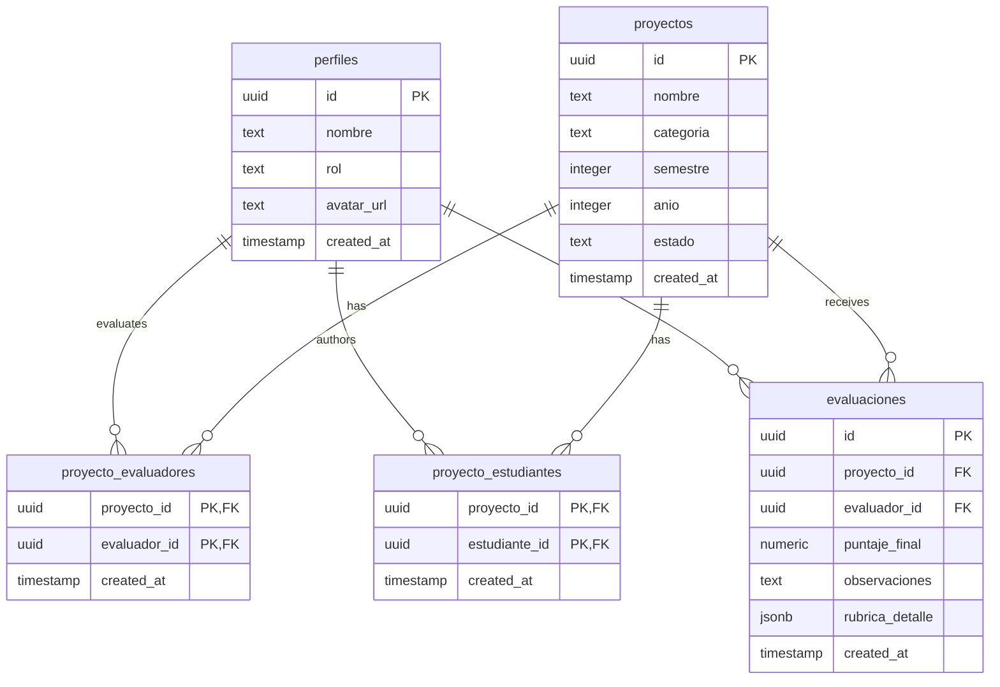

## Relationship Overview

The RuedaPro UNIPAZ database uses a normalized relational schema with the `proyectos` table as the central entity. Two junction tables (`proyecto_evaluadores` and `proyecto_estudiantes`) implement many-to-many relationships, while the `evaluaciones` table creates a one-to-many relationship between evaluators and projects.



## Core Relationships

### 1. Projects to Evaluators (Many-to-Many)

**Junction Table:** `proyecto_evaluadores`

A project can be evaluated by multiple docentes (typically 1-3), and each docente can evaluate multiple projects. The junction table enforces that each evaluator is assigned only once per project.

#### Relationship Details

- **Type:** Many-to-Many
- **Foreign Keys:**
  - `proyecto_id` → `proyectos.id`
  - `evaluador_id` → `perfiles.id` (where `rol = 'docente'`)
- **Composite Primary Key:** `(proyecto_id, evaluador_id)`

#### Example Query: Projects Assigned to an Evaluator

```sql
SELECT 
    p.id,
    p.nombre AS project_name,
    p.categoria,
    p.semestre,
    p.anio,
    p.estado
FROM proyectos p
INNER JOIN proyecto_evaluadores pe ON pe.proyecto_id = p.id
WHERE pe.evaluador_id = 'evaluator-uuid-here'
ORDER BY p.created_at DESC;
```

#### Usage in Code (docenteDashboardView.js:156-171)

```javascript
// Fetch all projects assigned to the current evaluator with nested evaluation data
const { data: assignments, error } = await supabaseClient
    .from('proyecto_evaluadores')
    .select(`
        proyecto_id,
        proyectos (
            id,
            nombre,
            categoria,
            semestre,
            anio,
            estado,
            evaluaciones (evaluador_id, puntaje_final)
        )
    `)
    .eq('evaluador_id', currentProfile.id);
```

### 2. Projects to Students (Many-to-Many)

**Junction Table:** `proyecto_estudiantes`

A project can have multiple student authors (team projects), and students can be associated with multiple projects over time. The junction table links students to their authored projects.

#### Relationship Details

- **Type:** Many-to-Many
- **Foreign Keys:**
  - `proyecto_id` → `proyectos.id`
  - `estudiante_id` → `perfiles.id` (where `rol = 'estudiante'`)
- **Composite Primary Key:** `(proyecto_id, estudiante_id)`

#### Example Query: Students for a Specific Project

```sql
SELECT 
    perf.id,
    perf.nombre AS student_name,
    perf.created_at AS registered_date
FROM perfiles perf
INNER JOIN proyecto_estudiantes pe ON pe.estudiante_id = perf.id
WHERE pe.proyecto_id = 'project-uuid-here'
  AND perf.rol = 'estudiante'
ORDER BY perf.nombre;
```

#### Usage in Code (estudianteDashboardView.js:32-45)

```javascript
// Fetch all projects assigned to the current student with evaluations
const { data: assignments, error: aErr } = await supabaseClient
    .from('proyecto_estudiantes')
    .select(`
        proyecto_id,
        proyectos (
            id, nombre, categoria, semestre, anio, estado,
            evaluaciones (
                puntaje_final,
                observaciones,
                perfiles (nombre)
            )
        )
    `)
    .eq('estudiante_id', currentProfile.id);
```

### 3. Projects to Evaluations (One-to-Many)

**Direct Relationship:** `evaluaciones.proyecto_id` → `proyectos.id`

Each project receives multiple evaluation records (one from each assigned evaluator). An evaluation belongs to exactly one project and is submitted by exactly one evaluator.

#### Relationship Details

- **Type:** One-to-Many (Project has many Evaluations)
- **Foreign Keys:**
  - `proyecto_id` → `proyectos.id`
  - `evaluador_id` → `perfiles.id` (where `rol = 'docente'`)

#### Example Query: All Evaluations for a Project

```sql
SELECT 
    e.id,
    e.puntaje_final,
    e.observaciones,
    e.created_at AS submitted_at,
    perf.nombre AS evaluator_name
FROM evaluaciones e
INNER JOIN perfiles perf ON perf.id = e.evaluador_id
WHERE e.proyecto_id = 'project-uuid-here'
ORDER BY e.created_at DESC;
```

#### Calculate Average Score

```sql
SELECT 
    p.id,
    p.nombre AS project_name,
    AVG(e.puntaje_final) AS average_score,
    COUNT(e.id) AS total_evaluations
FROM proyectos p
INNER JOIN evaluaciones e ON e.proyecto_id = p.id
WHERE p.id = 'project-uuid-here'
GROUP BY p.id, p.nombre;
```

#### Usage in Code (evaluacionView.js:301-317)

```javascript
// Count assigned evaluators vs completed evaluations
const { data: assignedData, error: assignedErr } = await supabaseClient
    .from('proyecto_evaluadores')
    .select('evaluador_id', { count: 'exact' })
    .eq('proyecto_id', currentEvaluationProjectId);
    
const totalEvaluators = assignedData.length;

const { data: evalsData, error: evalsErr } = await supabaseClient
    .from('evaluaciones')
    .select('evaluador_id', { count: 'exact' })
    .eq('proyecto_id', currentEvaluationProjectId);
    
const totalEvaluated = evalsData.length;

// Update project status if all evaluators have submitted
if (totalEvaluated >= totalEvaluators && totalEvaluators > 0) {
    await supabaseClient
        .from('proyectos')
        .update({ estado: 'Evaluado' })
        .eq('id', currentEvaluationProjectId);
}
```

### 4. Evaluators to Evaluations (One-to-Many)

**Direct Relationship:** `evaluaciones.evaluador_id` → `perfiles.id`

Each evaluator (docente) can submit multiple evaluations over time. An evaluation record is authored by exactly one evaluator.

#### Relationship Details

- **Type:** One-to-Many (Evaluator has many Evaluations)
- **Foreign Key:** `evaluador_id` → `perfiles.id`
- **Constraint:** Each evaluator can submit only ONE evaluation per project

#### Example Query: All Evaluations by a Specific Evaluator

```sql
SELECT 
    e.id,
    p.nombre AS project_name,
    p.categoria,
    e.puntaje_final,
    e.created_at AS submitted_at
FROM evaluaciones e
INNER JOIN proyectos p ON p.id = e.proyecto_id
WHERE e.evaluador_id = 'evaluator-uuid-here'
ORDER BY e.created_at DESC;
```

## Complex Nested Queries

### Complete Project Dashboard (Admin View)

From `adminDashboardView.js:537-544`:

```javascript
const { data, error } = await supabaseClient
    .from('proyectos')
    .select(`
        *,
        proyecto_evaluadores (
            perfiles (nombre)
        )
    `)
    .order('created_at', { ascending: false });
```

**Result Structure:**
```json
{
  "id": "uuid",
  "nombre": "Sistema IoT",
  "categoria": "Desarrollo",
  "semestre": 1,
  "anio": 2026,
  "estado": "Evaluado",
  "proyecto_evaluadores": [
    {
      "perfiles": {
        "nombre": "Dr. Carlos Martínez"
      }
    },
    {
      "perfiles": {
        "nombre": "Dra. Ana López"
      }
    }
  ]
}
```

### Student Results View with Multiple Evaluations

From `resultsView.js:79-91`:

```javascript
const { data: proyectos, error: pErr } = await supabaseClient
    .from('proyectos')
    .select(`
        id, nombre, categoria, semestre, anio, estado,
        evaluaciones ( puntaje_final ),
        proyecto_estudiantes (
            perfiles ( nombre )
        )
    `)
    .eq('estado', 'Evaluado')
    .eq('anio', year)
    .eq('semestre', semester)
    .eq('categoria', category);
```

**Processing Logic:**
```javascript
let rankedProjects = proyectos.map(p => {
    let avgScore = 0;
    if (p.evaluaciones && p.evaluaciones.length > 0) {
        const totalScore = p.evaluaciones.reduce((acc, curr) => 
            acc + parseFloat(curr.puntaje_final || 0), 0
        );
        avgScore = parseFloat((totalScore / p.evaluaciones.length).toFixed(1));
    }
    
    let studentsText = p.proyecto_estudiantes
        .map(pe => pe.perfiles?.nombre)
        .join(', ');

    return {
        nombre: p.nombre,
        students: studentsText,
        score: avgScore
    };
});

rankedProjects.sort((a, b) => b.score - a.score);
const top5 = rankedProjects.slice(0, 5);
```

### Project Evaluation Status Check

From `evaluacionView.js:147-157`:

```javascript
const { data: pData, error: pErr } = await supabaseClient
    .from('proyectos')
    .select(`
        *,
        proyecto_estudiantes (
            perfiles (nombre)
        )
    `)
    .eq('id', projectId)
    .single();

let studentsText = 'Sin asignar';
if (pData.proyecto_estudiantes && pData.proyecto_estudiantes.length > 0) {
    studentsText = pData.proyecto_estudiantes
        .map(pe => pe.perfiles?.nombre)
        .join(', ');
}
```

## Referential Integrity Rules

### Cascade Behaviors

<Card title="ON DELETE CASCADE" icon="trash">
  **Recommended for junction tables:**
  - When a project is deleted, automatically remove all entries in `proyecto_evaluadores` and `proyecto_estudiantes`
  - When a user profile is deleted, remove their entries from junction tables

  ```sql
  ALTER TABLE proyecto_evaluadores
  ADD CONSTRAINT fk_proyecto
  FOREIGN KEY (proyecto_id) 
  REFERENCES proyectos(id) 
  ON DELETE CASCADE;
  ```
</Card>

<Card title="ON DELETE RESTRICT" icon="shield">
  **Recommended for evaluations:**
  - Prevent deletion of projects that have submitted evaluations
  - Maintain historical evaluation data integrity

  ```sql
  ALTER TABLE evaluaciones
  ADD CONSTRAINT fk_proyecto
  FOREIGN KEY (proyecto_id) 
  REFERENCES proyectos(id) 
  ON DELETE RESTRICT;
  ```
</Card>

### Orphan Record Prevention

Always verify relationships before insertion:

```javascript
// Before assigning evaluator to project
const { data: evaluatorExists } = await supabaseClient
    .from('perfiles')
    .select('id')
    .eq('id', evaluatorId)
    .eq('rol', 'docente')
    .single();

if (evaluatorExists) {
    await supabaseClient
        .from('proyecto_evaluadores')
        .insert([{ proyecto_id: projectId, evaluador_id: evaluatorId }]);
}
```

## Query Optimization Tips

<AccordionGroup>
  <Accordion title="Use Selective Projections">
    Only fetch the columns you need to reduce payload size:
    
    ```javascript
    // Good: Only fetch required fields
    .select('id, nombre, categoria')
    
    // Avoid: Fetching all columns when not needed
    .select('*')
    ```
  </Accordion>

  <Accordion title="Limit Nested Data Depth">
    Avoid deeply nested queries that can cause performance issues:
    
    ```javascript
    // Good: Two-level nesting
    .select('*, proyecto_evaluadores(perfiles(nombre))')
    
    // Avoid: Excessive nesting
    .select('*, proyecto_evaluadores(perfiles(*, nested_table(*)))')
    ```
  </Accordion>

  <Accordion title="Use Eager Loading for Relationships">
    Fetch related data in a single query instead of N+1 queries:
    
    ```javascript
    // Good: Single query with joins
    const { data } = await supabaseClient
        .from('proyectos')
        .select('*, evaluaciones(*), proyecto_estudiantes(*)');
    
    // Avoid: Multiple separate queries
    const projects = await supabaseClient.from('proyectos').select('*');
    for (const p of projects) {
        const evals = await supabaseClient
            .from('evaluaciones')
            .select('*')
            .eq('proyecto_id', p.id);
    }
    ```
  </Accordion>

  <Accordion title="Index Foreign Keys">
    Ensure all foreign key columns are indexed for optimal JOIN performance:
    
    ```sql
    CREATE INDEX idx_proyecto_evaluadores_proyecto_id 
    ON proyecto_evaluadores(proyecto_id);
    
    CREATE INDEX idx_proyecto_evaluadores_evaluador_id 
    ON proyecto_evaluadores(evaluador_id);
    
    CREATE INDEX idx_evaluaciones_proyecto_id 
    ON evaluaciones(proyecto_id);
    
    CREATE INDEX idx_evaluaciones_evaluador_id 
    ON evaluaciones(evaluador_id);
    ```
  </Accordion>
</AccordionGroup>

## Common Join Patterns

### Inner Join: Projects with Assigned Evaluators

```sql
SELECT 
    p.nombre AS project_name,
    perf.nombre AS evaluator_name,
    pe.created_at AS assigned_date
FROM proyectos p
INNER JOIN proyecto_evaluadores pe ON pe.proyecto_id = p.id
INNER JOIN perfiles perf ON perf.id = pe.evaluador_id
WHERE p.estado = 'Pendiente';
```

### Left Join: Projects with Optional Evaluations

```sql
SELECT 
    p.nombre AS project_name,
    p.estado,
    COUNT(e.id) AS evaluation_count,
    AVG(e.puntaje_final) AS average_score
FROM proyectos p
LEFT JOIN evaluaciones e ON e.proyecto_id = p.id
GROUP BY p.id, p.nombre, p.estado;
```

### Multi-Table Join: Complete Project Overview

```sql
SELECT 
    p.nombre AS project_name,
    p.categoria,
    p.estado,
    STRING_AGG(DISTINCT stud.nombre, ', ') AS students,
    STRING_AGG(DISTINCT eval.nombre, ', ') AS evaluators,
    AVG(e.puntaje_final) AS average_score
FROM proyectos p
LEFT JOIN proyecto_estudiantes pe_stud ON pe_stud.proyecto_id = p.id
LEFT JOIN perfiles stud ON stud.id = pe_stud.estudiante_id
LEFT JOIN proyecto_evaluadores pe_eval ON pe_eval.proyecto_id = p.id
LEFT JOIN perfiles eval ON eval.id = pe_eval.evaluador_id
LEFT JOIN evaluaciones e ON e.proyecto_id = p.id
GROUP BY p.id, p.nombre, p.categoria, p.estado;
```

## Best Practices

<Check>Always use transactions when creating projects with assignments to ensure atomicity</Check>
<Check>Verify foreign key references exist before insertion to prevent orphaned records</Check>
<Check>Use composite indexes on junction table primary keys for optimal performance</Check>
<Check>Leverage Supabase's nested SELECT syntax for efficient data fetching</Check>
<Check>Implement proper error handling for foreign key constraint violations</Check>
