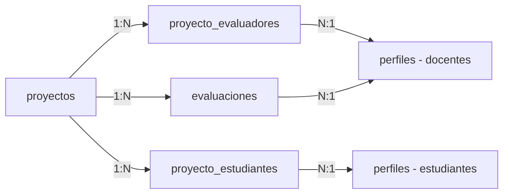

## Overview

The Project Management system in RuedaPro UNIPAZ enables administrators to register, organize, and track engineering projects throughout their evaluation lifecycle. Each project can be assigned to multiple evaluators (up to 3) and students, with comprehensive filtering and status tracking capabilities.

## Project Data Structure

### Core Project Fields

Each project in the system contains the following information:

| Field | Type | Description | Required |
|-------|------|-------------|----------|
| `nombre` | String | Project name/title | Yes |
| `categoria` | Enum | Project category | Yes |
| `semestre` | Integer | Semester (1 or 2) | Yes |
| `anio` | Integer | Year (2020-2035) | Yes |
| `estado` | Enum | Current status | Yes |
| `created_at` | Timestamp | Registration date | Auto |

### Project Categories

Projects are classified into three main categories:

<CardGroup cols={3}>
  <Card title="Desarrollo" icon="code" color="#3b82f6">
    Software development and implementation projects
  </Card>
  <Card title="Propuesta" icon="lightbulb" color="#f59e0b">
    Research proposals and conceptual designs
  </Card>
  <Card title="Aplicación" icon="microchip" color="#10b981">
    Applied technology and hardware projects
  </Card>
</CardGroup>

```javascript adminDashboardView.js:210-214
<select id="new-project-cat" required>
    <option value="Desarrollo">Desarrollo</option>
    <option value="Propuesta">Propuesta</option>
    <option value="Aplicación">Aplicación</option>
</select>
```

## Project Lifecycle

### Project States

Projects progress through the following states:

<Steps>
  <Step title="Pendiente (Pending)">
    Initial state when a project is first registered. The project is awaiting evaluation.
    
    **Status Badge**: Yellow/Warning
  </Step>
  
  <Step title="Evaluado (Evaluated)">
    All assigned evaluators have completed their assessments. Final scores are calculated.
    
    **Status Badge**: Green/Success
    
    <Note>
      The project automatically transitions to "Evaluado" when ALL assigned evaluators submit their evaluations.
    </Note>
  </Step>
  
  <Step title="Vencida (Expired)">
    Project evaluation deadline has passed without complete evaluation.
    
    **Status Badge**: Red/Danger
  </Step>
</Steps>

### Automatic Status Updates

The system automatically updates project status when evaluations are completed:

```javascript evaluacionView.js:320-327
// Update project status ONLY if all have evaluated
if (totalEvaluated >= totalEvaluators && totalEvaluators > 0) {
    const { error: updErr } = await supabaseClient
        .from('proyectos')
        .update({ estado: 'Evaluado' })
        .eq('id', currentEvaluationProjectId);
}
```

## Project Registration Workflow

### Creating a New Project

Administrators can register projects through a comprehensive modal form:

<Steps>
  <Step title="Access Project Creation">
    From the Admin Dashboard, navigate to "Gestión de Proyectos" and click "+ Nuevo Proyecto"
  </Step>
  
  <Step title="Enter Project Details">
    Fill in the required project information:
    
    **Basic Information:**
    - Project name (e.g., "Sistema IoT para Invernaderos Inteligentes")
    - Category selection (Desarrollo, Propuesta, or Aplicación)
    - Semester (1 or 2)
    - Year (2020-2035)
    
    ```javascript adminDashboardView.js:716-722
    const payload = {
        nombre: document.getElementById('new-project-name').value.trim(),
        categoria: document.getElementById('new-project-cat').value,
        semestre: parseInt(document.getElementById('new-project-sem').value),
        anio: parseInt(document.getElementById('new-project-year').value),
        estado: 'Pendiente'
    };
    ```
  </Step>
  
  <Step title="Assign Evaluators">
    Select up to 3 evaluators (docentes) for the project:
    
    - **Evaluador 1**: Primary evaluator (required)
    - **Evaluador 2**: Secondary evaluator (optional)
    - **Evaluador 3**: Tertiary evaluator (optional)
    
    <Warning>
      At least ONE evaluator must be assigned to create a project. The system will prevent submission without an evaluator.
    </Warning>
    
    The dropdown menus dynamically prevent selecting the same evaluator multiple times:
    
    ```javascript adminDashboardView.js:670-695
    function updateEvaluatorDropdowns() {
        const sel1 = document.getElementById('new-project-evaluator-1');
        const sel2 = document.getElementById('new-project-evaluator-2');
        const sel3 = document.getElementById('new-project-evaluator-3');
        
        const val1 = sel1.value;
        const val2 = sel2.value;
        const val3 = sel3.value;
        
        // Disable already-selected evaluators in other dropdowns
        allDropdowns.forEach(current => {
            const otherVals = allDropdowns.filter(d => d.el !== current.el).map(d => d.val);
            Array.from(current.el.options).forEach(opt => {
                if (opt.value === "") return;
                opt.disabled = otherVals.includes(opt.value);
            });
        });
    }
    ```
  </Step>
  
  <Step title="Assign Student (Optional)">
    Optionally assign a student as the project author. This links the project to a specific student account.
  </Step>
  
  <Step title="Submit Project">
    Click "Registrar Proyecto" to create the project. The system will:
    
    1. Insert the project into the `proyectos` table
    2. Create evaluator assignments in `proyecto_evaluadores` table
    3. Create student assignment in `proyecto_estudiantes` table (if provided)
    
    ```javascript adminDashboardView.js:741-768
    // 1. Create the project
    const { data: projData, error: projError } = await supabaseClient
        .from('proyectos')
        .insert([payload])
        .select()
        .single();
    
    // 2. Assign evaluators
    if (evaluatorIds.length > 0 && projData) {
        const evaluatorInserts = evaluatorIds.map(id => ({
            proyecto_id: projData.id,
            evaluador_id: id
        }));
        await supabaseClient
            .from('proyecto_evaluadores')
            .insert(evaluatorInserts);
    }
    
    // 3. Assign student
    if (studentId && projData) {
        await supabaseClient
            .from('proyecto_estudiantes')
            .insert([{ proyecto_id: projData.id, estudiante_id: studentId }]);
    }
    ```
  </Step>
</Steps>

## Evaluator Assignment

### Multiple Evaluators per Project

RuedaPro UNIPAZ supports assigning **up to 3 evaluators** per project for comprehensive assessment:

<Accordion title="Why Multiple Evaluators?">
  Multiple evaluators provide:
  - **Reduced bias**: Different perspectives on project quality
  - **Fair scoring**: Final grade is averaged across all evaluators
  - **Comprehensive feedback**: Multiple sets of observations and suggestions
  - **Academic rigor**: Mimics real-world academic assessment practices
</Accordion>

### Evaluator Selection Rules

<CardGroup cols={2}>
  <Card title="Minimum Required" icon="1">
    At least 1 evaluator must be assigned to every project
  </Card>
  <Card title="Maximum Allowed" icon="3">
    Up to 3 different evaluators can be assigned per project
  </Card>
</CardGroup>

<Warning>
  **Duplicate Prevention**: The system automatically disables already-selected evaluators in other dropdown menus to prevent assigning the same evaluator multiple times.
</Warning>

### Evaluator Dashboard Access

Assigned evaluators see their projects on their dashboard (`dashboard-docente`) with the ability to:
- View project details
- Access the evaluation rubric
- Submit scores and observations

## Student Assignment

### Linking Projects to Students

Projects can be associated with student accounts:

```javascript adminDashboardView.js:251-256
<select id="new-project-student">
    <option value="">-- Sin asignar --</option>
    <!-- Populated with students from perfiles table -->
</select>
<small>Autor del proyecto</small>
```

This enables:
- Students to view their own projects on their dashboard
- Proper attribution of project authorship
- Filtering projects by student
- Historical tracking of student work

## Filtering and Search

### Available Filters

Administrators can filter projects using multiple criteria:

<Tabs>
  <Tab title="Search by Name">
    ```javascript adminDashboardView.js:75
    <input type="text" id="admin-search-projects" placeholder="Buscar proyecto..." onkeyup="filterAdminProjects()">
    ```
    
    Full-text search across project names with 300ms debounce for performance.
  </Tab>
  
  <Tab title="Filter by Category">
    ```javascript adminDashboardView.js:76-81
    <select id="admin-filter-cat" onchange="filterAdminProjects()">
        <option value="">Todas las categorías</option>
        <option value="Desarrollo">Desarrollo</option>
        <option value="Propuesta">Propuesta</option>
        <option value="Aplicación">Aplicación</option>
    </select>
    ```
    
    Filter projects by their category type.
  </Tab>
</Tabs>

### Filter Implementation

The filtering system uses an in-memory cache for fast performance:

```javascript adminDashboardView.js:596-611
let adminProjectsDebounceTimer;
function filterAdminProjects() {
    clearTimeout(adminProjectsDebounceTimer);
    adminProjectsDebounceTimer = setTimeout(() => {
        const search = (document.getElementById('admin-search-projects')?.value || '').toLowerCase();
        const cat = document.getElementById('admin-filter-cat')?.value || '';

        const filtered = adminProjectsCache.filter(p => {
            const matchSearch = p.nombre.toLowerCase().includes(search);
            const matchCat = cat ? p.categoria === cat : true;
            return matchSearch && matchCat;
        });

        renderAdminProjectsTable(filtered);
    }, 300);
}
```

## Project Display

### Admin Projects Table

Projects are displayed in a comprehensive table with the following columns:

| Column | Description |
|--------|-------------|
| Nombre del Proyecto | Full project name |
| Categoría | Color-coded badge (Desarrollo/Propuesta/Aplicación) |
| Semestre | Semester number (1° or 2°) |
| Año | Year of the project |
| Docente Asignado | Names of all assigned evaluators |
| Estado | Status badge (Pendiente/Evaluado/Vencida) |
| Acciones | Delete button (with confirmation) |

### Loading Projects

```javascript adminDashboardView.js:533-554
async function loadAdminProjects() {
    const { data, error } = await supabaseClient
        .from('proyectos')
        .select(`
            *,
            proyecto_evaluadores (
                perfiles (nombre)
            )
        `)
        .order('created_at', { ascending: false });
    
    if(error) throw error;
    adminProjectsCache = data;
    renderAdminProjectsTable(data);
}
```

<Note>
  Projects are loaded with their related evaluator information using Supabase's query expansion feature, reducing the number of database queries needed.
</Note>

## Project Deletion

### Delete Workflow

Administrators can delete projects with a confirmation prompt:

```javascript adminDashboardView.js:782-798
async function deleteProject(projectId) {
    if(!confirm('¿Eliminar este proyecto? Esta acción no se puede deshacer.')) return;
    if(!supabaseClient) return;

    try {
        const { error } = await supabaseClient
            .from('proyectos')
            .delete()
            .eq('id', projectId);

        if(error) throw error;
        loadAdminProjects(); // Refresh
    } catch (e) {
        console.error("deleteProject Error:", e);
        alert("Ocurrió un error al intentar eliminar el proyecto.");
    }
}
```

<Warning>
  **Cascade Deletion**: When a project is deleted, related records in `proyecto_evaluadores`, `proyecto_estudiantes`, and `evaluaciones` tables are automatically removed through database cascade rules.
  
  This action is **irreversible** and will permanently delete all associated evaluation data.
</Warning>

## Database Relationships

### Related Tables



**Key Relationships:**
- One project can have multiple evaluators (stored in `proyecto_evaluadores`)
- One project can have multiple students (stored in `proyecto_estudiantes`)
- One project can have multiple evaluations (stored in `evaluaciones`)
- Evaluators and students are linked through the `perfiles` table

## Best Practices

<AccordionGroup>
  <Accordion title="Project Naming">
    Use descriptive, specific names that clearly identify the project:
    
    ✅ **Good**: "Sistema IoT para Invernaderos Inteligentes"
    
    ❌ **Bad**: "Proyecto 1", "IoT", "Sistema"
  </Accordion>
  
  <Accordion title="Evaluator Assignment">
    - Assign evaluators with relevant expertise in the project category
    - Distribute evaluation workload evenly across available docentes
    - Consider assigning 2-3 evaluators for important or complex projects
  </Accordion>
  
  <Accordion title="Category Selection">
    Choose the category that best fits the project's primary focus:
    - **Desarrollo**: For software development, coding projects
    - **Propuesta**: For research proposals, conceptual designs
    - **Aplicación**: For hardware, IoT, applied technology projects
  </Accordion>
  
  <Accordion title="Data Management">
    - Regularly review and archive old projects
    - Maintain consistent naming conventions
    - Document special requirements or notes in project management tools
  </Accordion>
</AccordionGroup>

## Related Features

<CardGroup cols={2}>
  <Card title="Evaluation System" icon="clipboard-check" href="/features/evaluation-system">
    Learn how evaluators assess projects using the rubric system
  </Card>
  <Card title="Results Gallery" icon="ranking-star" href="/features/results-gallery">
    See how evaluated projects appear in public rankings
  </Card>
</CardGroup>